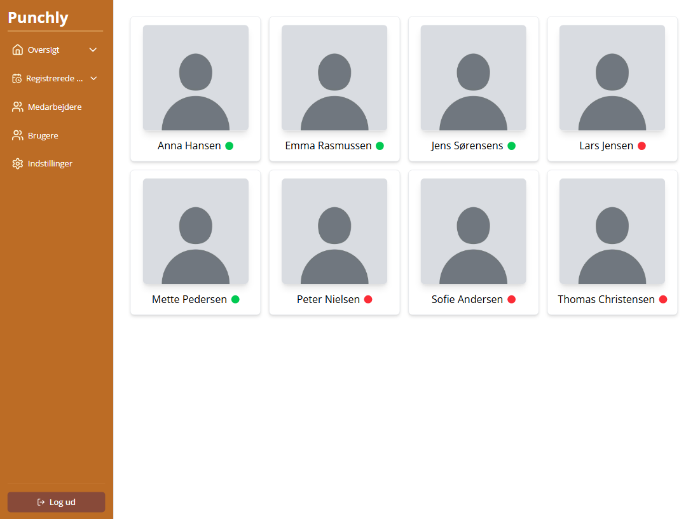
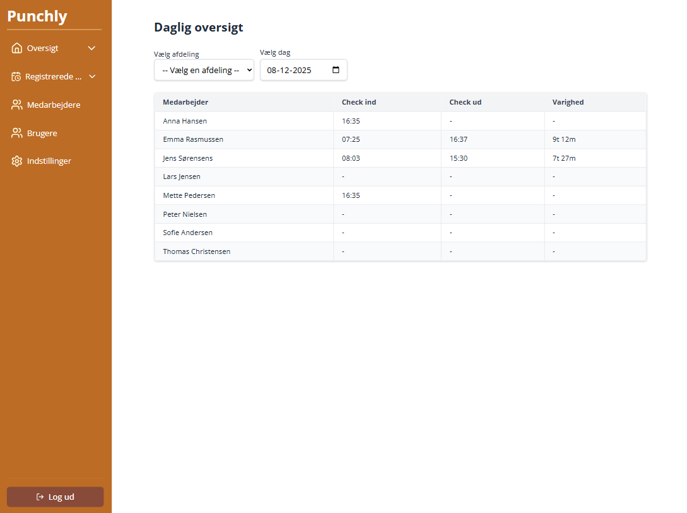
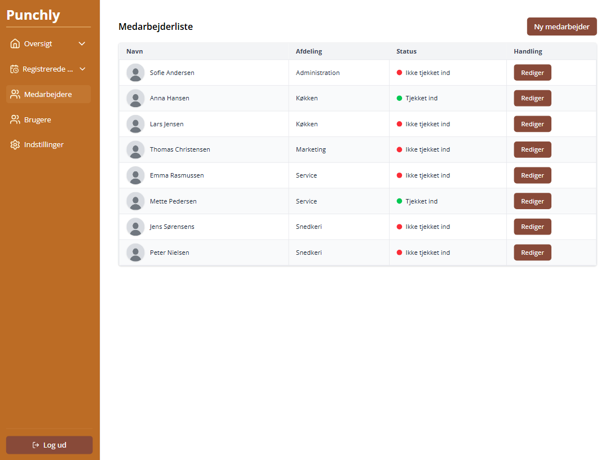
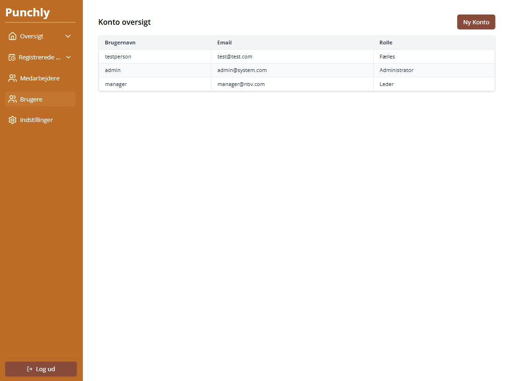
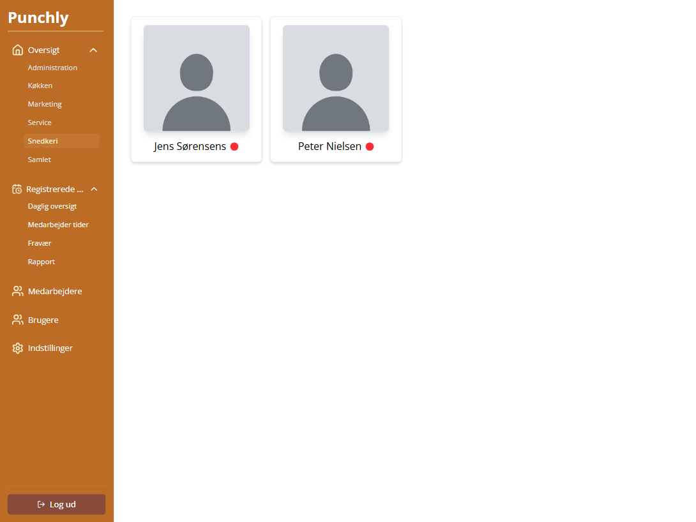

# Punchly


**Punchly** is a comprehensive employee management and time tracking system built to showcase advanced software engineering concepts. This project emphasizes clean architecture, type safety, and scalable design patterns that mirror real-world enterprise applications.

## 🎯 Project Highlights

- **Enterprise Architecture Patterns:** Three-layered backend architecture with clear separation of concerns
- **Dependency Injection:** Inversion of Control for testable, maintainable code
- **Type-Safe Development:** End-to-end TypeScript with strict type checking
- **Modern React Patterns:** Custom hooks, composition, and server state management
- **Role-Based Access Control:** Granular permission system with three authorization levels
- **Production Tooling:** Docker containerization, database migrations, logging, and testing infrastructure

## 🏗 Architecture

### Backend

- **Dependency Injection Container:** Services and repositories are injected, enabling easy mocking for unit tests and adherence to SOLID principles
- **Repository Pattern:** Abstracts data access logic, making the codebase database-agnostic
- **Service Layer:** Encapsulates business rules, keeping controllers thin and focused on HTTP concerns
- **Prisma ORM:** Type-safe database queries with automatic migration management

#### Tech Stack

- Node.js + Express
- TypeScript (strict mode)
- Prisma ORM
- Vitest for testing

### Frontend

The frontend emphasizes component composition and separation of data fetching from UI logic:

- **TanStack Query:** Server state management with automatic caching, background refetching, and optimistic updates
- **Custom Hooks:** Reusable logic encapsulation (e.g., `useAuth`, `useEmployees`)
- **Component Composition:** Small, focused components following Single Responsibility Principle (e.g., `DataTable`)
- **Type Safety:** Shared types between frontend and backend for contract validation

#### Tech Stack

- React + TypeScript
- TanStack Query (React Query)
- Modern React patterns (hooks, context, composition)

## 🔐 Authentication and Authorization

### Authentication

- Long-lived refresh tokens stored in cookie
- Short-lived access tokens stored in `localStorage`
- Secure password hashing with argon2
- Token rotation

### Authorization (RBAC)

| Role     | Capabilities                                                                |
| -------- | --------------------------------------------------------------------------- |
| Employee | Clock in/out                                                                |
| Manager  | All employee permissions + employee management, edit time entries, absences |
| Admin    | All manager permissions + user management, system configuration             |

The RBAC system uses middleware guards to protect routes and enforce permissions at both the API and UI levels.

## Tech Stack Summary

| Layer    | Technologies                                                 |
| -------- | ------------------------------------------------------------ |
| Frontend | React, TypeScript, TanStack Query                            |
| Backend  | Node.js, Express, TypeScript                                 |
| Database | Prisma ORM (tested with PostgreSQL and Microsoft SQL Server) |
| DevOps   | Docker, Docker Compose                                       |
| Testing  | Vitest                                                       |

---

## 🚀 Getting Started

### Prerequisites

- [Docker](https://www.docker.com/)
- [Docker Compose](https://docs.docker.com/compose/)

### Running Punchly Locally

Clone the repository:

```bash
git clone https://github.com/mikkelklitlund/punchly.git
cd punchly
```

Then start everything with Docker Compose:

```bash
docker-compose up --build
```

This will:

- Start a Microsoft SQL Server database
- Build and run the backend server on `http://localhost:4000`
- Build and run the frontend on `http://localhost:3000`

## Screenshots

Notes: screenshots are taken with the sizes of an iPad, as the initial design was for tablets.

### Dashboard view



### Daily overview



### Employee list view



### User overview



### Settings view


### Menu items view



---

## ⚠️ Disclaimer

**Punchly** was built as a personal project for **educational purposes**.

- While it uses modern libraries and attempt to follow good architectural practices, it is **not production-ready**.
- **Authentication and authorization are custom-built** and have not been formally tested for security vulnerabilities.
- Do not use this system to handle sensitive or real employee data in its current state.
